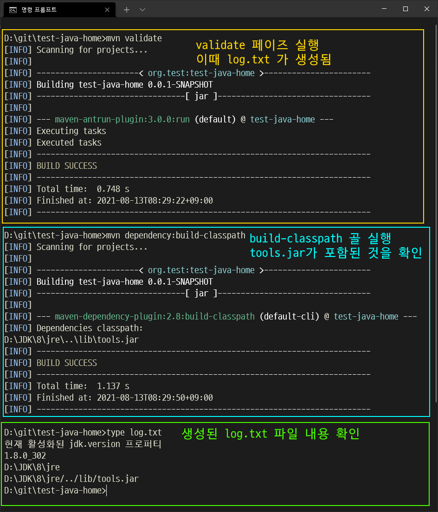
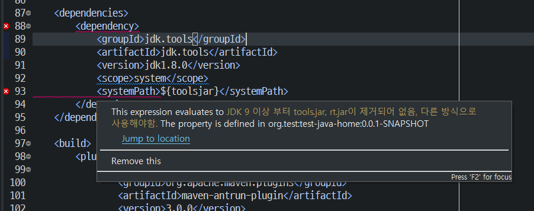
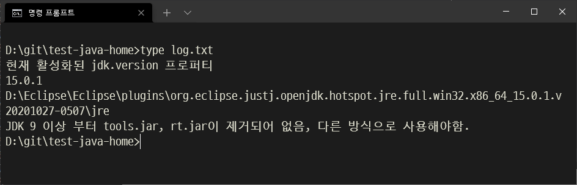
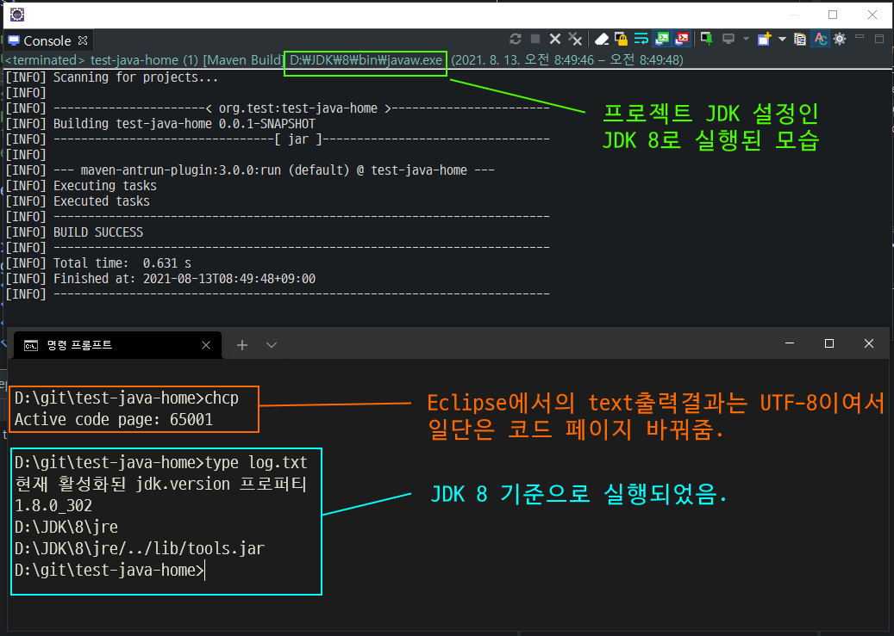
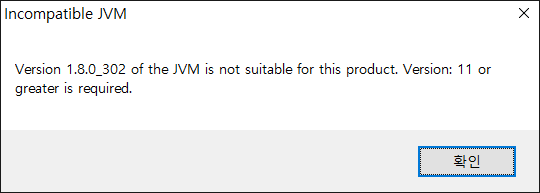

## Eclipse에서  Maven ${java.home} 속성이 프로젝트 JDK설정을 사용하지 않는 문제

JDK 1.8 프로젝트에서 tools.jar의 경로를 찾아 Maven 디펜던시를 적용하는 내용을 IntelliJ 에서 문제없이 했다가,
Eclipse에서도 동일하게 동작하나 확인을 했을 때, 정상동작하지 않아 테스트 프로젝트 만들어서 좀 더 확인을 했다.

* 프로젝트명
  * test-java-home

* 하는 일

  * Maven validate 페이즈단계에서  환경설정 속성 값들을 출력하고 tools.jar를 디펜던시에 추가하는 일을 함.
    * 별도 Java 소스코드는 없음.

  
### JDK 8 환경에서 mvn으로 커맨드라인 실행  

커맨드 라인으로 Maven 빌드를 실행했을 때는 의도한 대로 잘 동작 하였다.

* tools.jar가 디펜던시에 정상 포함
* log.txt 파일 내용이 JDK 8 기준으로 정상 설정




## Eclipse에서 실행

Eclipse에서는 디펜던시에서 에러가 나고, JDK 15일때, 설정되야할 값이 toolsjar 프로퍼티 값으로 들어가 있다.



관련 부분 프로파일 설정은 아래와 같이 되어있음.

```xml
<profile>
    <id>test_8</id>
    <activation>
        <jdk>1.8</jdk>
    </activation>

    <properties>
        <jdk.version>1.8</jdk.version>
        <java.home.prop>${java.home}</java.home.prop>
        <toolsjar>${java.home}/../lib/tools.jar</toolsjar>
    </properties>
</profile>

<profile>
    <id>test_15</id>
    <activation>
        <jdk>15</jdk>
    </activation>
    
    <properties>
        <jdk.version>15</jdk.version>
        <java.home.prop>${java.home}</java.home.prop>
        <toolsjar>JDK 9 이상 부터 tools.jar, rt.jar이 제거되어 없음, 다른 방식으로 사용해야함.</toolsjar>
    </properties>
</profile>
```

`Eclipse에서 해당 프로젝트 JDK 설정이 1.8로 되어있음에도 불구하고, JDK 15 설정 기준으로 인식이 되는 현상...`

오류를 회피하기 위해 디펜던시의 toolsjar 부분을 제거하고 프로젝트 클린 (Project -> Clean...) 이후 프로젝트 빌드하고  log.txt를 확인해보면..<br>
m2e에 의해 maven ant 플러그인이 실행된 내용인데,  확실이 JDK 15 기준으로 실행된 것이 맞고,<br>JDK경로를 보면 `eclipse.ini`에 `-vm`파라미터 이하에 설정 된 경로와 일치한다.

* `프로젝트 빌드`: Eclipse에서 Project -> Build Project  메뉴로 빌드하는 것



그런데, 이런 상태에서 Eclipse의 Run As -> Maven build로 validate 페이즈를 실행하면,<br> 이 부분은 프로젝트 JDK 설정대로 1.8 로 실행이 됨 ㅠㅠ.



eclipse.ini의 -vm 설정을 JDK 8 경로로 바꾸면 자연스럽게 해결되긴하겠지만...

####  eclipse.ini 의 -vm 속성을  JDK 8 로 바꾸고 실행하면, 2021-06  버전은 실행이 불가능하다.



Eclipse 2021-06 버전의 최소 사양은 JDK 11 이상이여서 설정할 수 없음. 적용하기 위해서는 이전 버전을 사용해야함.


## 결론

* eclipse의 Maven프로젝트 환경에서, 기본 상태와 프로젝트 빌드시에 pom.xml의  ${java.home} 속성이 프로젝트의 JDK속성을 따르지 않고, eclipse를 실행하는 JDK를 따르는 문제가 있음. 
그런데 Maven Build 메뉴로 실행시에는 프로젝트 JDK 기준으로 정상 실행하는 모습을 보임.

* 문제 회피방법으로  JAVA_8_HOME 과 같은 환경 변수를 정의해두고,  pom.xml 내에서 `${env.JAVA_8_HOME}` 로 직접 환경변수 값을 얻어오는 방법이 있음. 
* IntelliJ에서는 이런 문제가 없이 ${java.home}의 값이 항상 프로젝트 JDK 설정으로 잘 적용됨.

### 기타

#### ant-contrib 사용시 `Caused by: java.lang.NoSuchMethodError: org.apache.tools.ant.util.FileUtils.getFileUtils()Lorg/apache/tools/ant/util/FileUtils;` 오류
*  ant-contrib 자체에서 디펜던시가 오래된 버전의 ant를 끌고 오는 것 같다.  그래서 maven-antrun-plugin에서 그런 메서드가 없다는 오류가 나오는 것 같다.
*   ant를 exclude 해두도록 한다.
  ```xml
  <dependency>
    <groupId>ant-contrib</groupId>
    <artifactId>ant-contrib</artifactId>
    <version>1.0b3</version>
    <exclusions>
      <exclusion>
        <groupId>ant</groupId>
        <artifactId>ant</artifactId>
      </exclusion>
    </exclusions>
  </dependency>
  ```
* https://repo1.maven.org/maven2/ant-contrib/ant-contrib/1.0b3/ant-contrib-1.0b3.pom
	* 위의 pom.xml내용을 보면 ant-contrib이 ant 1.5 버전을 디펜던시하는 것을 알 수 있다.

* maven-antrun-plugin에 ant 1.9.14.jar를 디펜던시하기 때문에 일부러 ant를 디펜던시 해줄 필요는 없는 것 같다.


### eclipse 2021-12 버전에서 동작 확인

m2e로 빌드될 때는 여전히 eclipse 실행 JDK 버전 기준으로 동작한다. 앞으로도 고쳐주진 않을 것 같음.

```
현재 활성화된 jdk.version 프로퍼티
17.0.1
D:\Eclipse\eclipse\plugins\org.eclipse.justj.openjdk.hotspot.jre.full.win32.x86_64_17.0.1.v20211116-1657\jre
JDK 9 이상 부터 tools.jar, rt.jar이 제거되어 없음, 다른 방식으로 사용해야함.
```


#### 이미지 사용 글꼴

* Naver D2 Coding


### 참조

* https://stackoverflow.com/questions/3080437/jdk-tools-jar-as-maven-dependency
* https://bugs.eclipse.org/bugs/show_bug.cgi?id=432992
* https://docs.oracle.com/en/java/javase/11/migrate/migration-guide.pdf